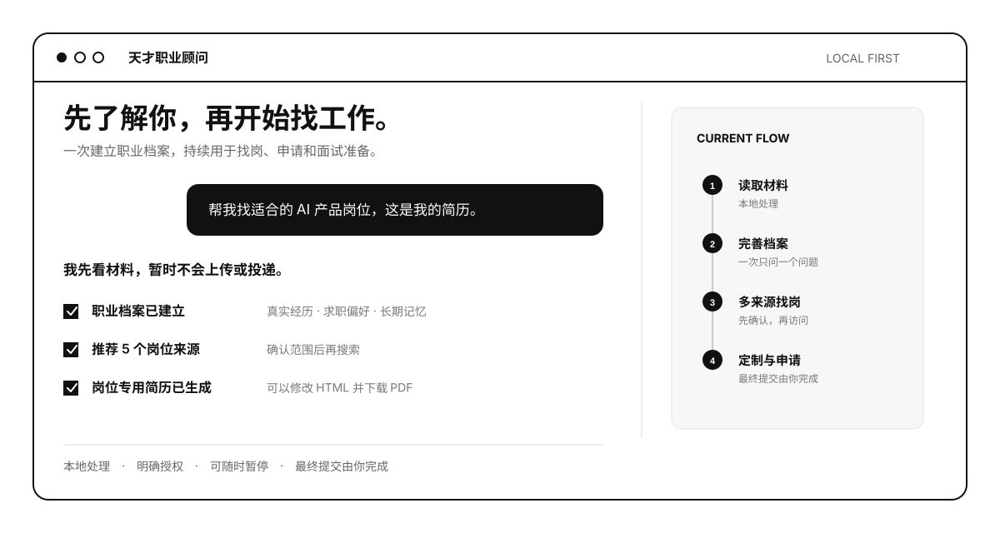
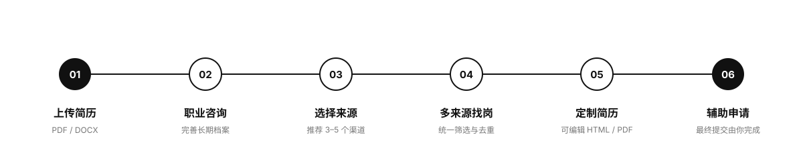

<div align="center">

# 天才职业顾问

### 让你的 Agent 真正了解你，再帮你找工作

上传一份简历，建立可以长期复用的职业档案。<br>
从泛函与适合你的招聘渠道寻找岗位，针对每个 JD 完善经历、生成专用简历并辅助申请。

<p>
  <a href="#快速开始"><strong>开始使用</strong></a>
  &nbsp;&nbsp;·&nbsp;&nbsp;
  <a href="#它是怎么工作的"><strong>查看流程</strong></a>
  &nbsp;&nbsp;·&nbsp;&nbsp;
  <a href="#真实能力边界"><strong>能力边界</strong></a>
</p>



<sub>当前为黑白视觉预览。正式主演示 GIF 将使用脱敏测试简历录制，不展示真实候选人资料。</sub>

</div>

---

## 它不只是帮你改简历

普通 AI 往往只看当前简历，改几句话，然后忘记你是谁。

天才职业顾问会先理解你的真实经历，把一次沟通沉淀成长期职业档案，再把这些信息用于找岗、选岗、定制简历、辅助申请和后续面试准备。

<table>
<tr>
<td width="33%" valign="top">

### 01　先了解你

读取 PDF 或 DOCX，通过简短咨询挖掘成果、个人贡献、关键判断和可验证结果。

</td>
<td width="33%" valign="top">

### 02　再帮你选

根据求职方向推荐 3–5 个合适渠道，再统一整理泛函与确认过的外部岗位。

</td>
<td width="33%" valign="top">

### 03　最后帮你申请

结合具体 JD 补充经历、生成可编辑简历，并把无法可靠填写的申请字段一次整理清楚。

</td>
</tr>
</table>

---

## 它是怎么工作的



### 1. 上传原始材料

把简历发给 Agent。作品集、GitHub 和个人网站都是可选材料，不会因为缺少链接阻止建档。

### 2. 建立长期职业档案

Agent 先读材料，再围绕最有潜力的一段经历逐步追问。每次只问一个问题，不让你重新填写一张长表。

### 3. 选择合适的岗位来源

Skill 内置经过整理的岗位来源快照，会根据方向、城市和办公方式推荐 3–5 个渠道。你确认后才开始访问，不会一次打开几十个网站浪费 Token。

### 4. 统一搜索和判断岗位

同一轮整理泛函与已确认外部来源，展示来源状态、匹配点、缺口和风险。泛函岗位不会被静默置顶，重复岗位会被合并。

### 5. 生成岗位专用简历

你选定岗位后，Agent 会针对 JD 再问 1–2 个最值得补充的问题，生成可以直接修改的 HTML 简历。你检查并下载 PDF，再把文件发回当前对话。

### 6. 辅助申请，由你提交

Agent 读取完整申请表，能可靠填写的尽量填写；需要你处理的字段、答案和文件会一次性整理。登录、验证码、文件选择和最终提交仍由你本人完成。

---

## 快速开始

### 安装

天才职业顾问依赖独立的「职业资产」Skill。下面两条命令已使用通用 Agent Skills 安装器验证，可以自动识别当前支持的 Agent runtime。

```bash
npx skills add Ivor-NCUT/career-assets-skill -g -y --copy
npx skills add Zkkk-web/Agent-Resume-Submission-Platform -g \
  --skill fanhan-job-agent apply-external-jobs -y --copy
```

也可以直接告诉你的 Agent：

```text
请帮我安装这两个 Skill：
https://github.com/Ivor-NCUT/career-assets-skill
https://github.com/Zkkk-web/Agent-Resume-Submission-Platform
```

<details>
<summary><strong>手动安装到 Codex</strong></summary>

```bash
git clone https://github.com/Ivor-NCUT/career-assets-skill.git
git clone https://github.com/Zkkk-web/Agent-Resume-Submission-Platform.git

mkdir -p "${CODEX_HOME:-$HOME/.codex}/skills/career-assets-fanhan/assets"
mkdir -p "${CODEX_HOME:-$HOME/.codex}/skills/fanhan-job-agent"
mkdir -p "${CODEX_HOME:-$HOME/.codex}/skills/apply-external-jobs"

cp career-assets-skill/SKILL.md \
  "${CODEX_HOME:-$HOME/.codex}/skills/career-assets-fanhan/SKILL.md"
cp -R career-assets-skill/assets/. \
  "${CODEX_HOME:-$HOME/.codex}/skills/career-assets-fanhan/assets/"

cp -R Agent-Resume-Submission-Platform/fanhan-job-agent/. \
  "${CODEX_HOME:-$HOME/.codex}/skills/fanhan-job-agent/"

cp -R Agent-Resume-Submission-Platform/apply-external-jobs/. \
  "${CODEX_HOME:-$HOME/.codex}/skills/apply-external-jobs/"
```

</details>

### 第一句 Prompt

上传简历，然后只需要说：

```text
使用 $fanhan-job-agent 帮我找适合的工作，这是我的简历。
```

剩下的建档、咨询、来源推荐和岗位整理，由 Skill 自己推进。普通用户不需要记一段很长的测试 Prompt。

---

## 常用场景

### 先找岗，暂时不投递

```text
请先建立我的职业档案，再同时搜索泛函和适合我的外部招聘渠道。
先展示来源状态和岗位结果，暂时不要投递。
```

### 针对一个岗位完善简历

```text
我想申请这个岗位。请先分析匹配点、缺口和风险，
再问我 1–2 个最值得补充的问题，最后生成一份可编辑的岗位专用简历。
```

### 准备申请表

```text
我确认申请这个岗位。请读取完整申请表，能可靠填写的帮我填写；
不能填写的字段一次性整理给我。最终提交由我点击。
```

### 进入面试准备

```text
我已经进入这个岗位的面试阶段，请根据我的职业档案和 JD 帮我模拟面试。
一次问一个问题。
```

---

## 真实能力边界

| 能力 | 当前状态 |
|---|---|
| PDF / DOCX 材料读取与职业档案 | 已支持 |
| 首次五维职业咨询与长期本地记忆 | 已支持 |
| 从 63 条来源快照推荐 3–5 个渠道 | 已支持 |
| 泛函、Bonjour、Watcha、JobRadar 结构化岗位发现 | 已支持；JobRadar 完整内容可能需要会员 |
| 其他招聘来源 | 用户确认后的定向探索，不承诺稳定适配 |
| JD 匹配分析与 1–2 个针对性问题 | 已支持 |
| 可编辑 HTML 简历与用户下载 PDF | 已支持 |
| 外部申请表辅助填写 | 已支持辅助流程，效果受网站与浏览器能力影响 |
| 最终提交 | 必须由用户本人确认和点击 |
| 泛函档案提交与内部招聘通知 | 仅在候选人明确授权后执行 |
| WorkBuddy | 已完成安装、触发与材料采集烟测；完整外部申请仍以 Codex 为主 |

> 这不是一个“自动海投 63 个网站”的工具。它提供的是可检查、可暂停、可由用户接管的求职工作流。

---

## 隐私与控制

- 原始材料默认只在当前本地环境处理。
- 未经明确授权，不向泛函或招聘网站发送简历、联系方式和作品集。
- 不保存招聘网站密码、Cookie、验证码或登录状态。
- 当前打开的网页不代表用户选择了这个岗位。
- 发送个人信息前必须说明接收方和字段范围。
- 最终提交按钮始终由用户本人点击。

详细规则见 [隐私与本地存储](fanhan-job-agent/references/privacy-and-storage.md)。

---

## Skill 之外，泛函还能继续帮你

天才职业顾问可以独立、免费地运行在你自己的 Agent 中。是否把职业档案交给泛函，是另一个需要单独确认的选择。

<table>
<tr>
<td width="50%" valign="top">

### 对候选人

- 招聘团队人工审核职业档案；
- 匹配泛函自己的岗位和合作企业岗位；
- 出现合适机会时主动联系；
- 为优秀候选人提供企业推荐或内推；
- 进入面试后继续复用同一份职业档案准备表达。

</td>
<td width="50%" valign="top">

### 对企业

- 发布 AI、Agent、产品与技术岗位；
- 获取经过职业咨询和材料核验的候选人；
- 由泛函完成初步筛选、推荐和后续招聘协作；
- 按现有企业招聘与猎头服务方式合作。

</td>
</tr>
</table>

<div align="center">

**候选人免费使用 Skill　·　企业通过招聘服务与泛函合作**

<a href="#快速开始"><strong>我是候选人｜开始使用</strong></a>
&nbsp;&nbsp;·&nbsp;&nbsp;
<strong>我是企业｜联系泛函招聘团队</strong>

</div>

---

## 开发者说明

<details>
<summary><strong>仓库结构</strong></summary>

- `fanhan-job-agent`：面向用户的唯一产品入口，技术标识为 `$fanhan-job-agent`。
- `apply-external-jobs`：来源筛选、结构化岗位发现、选岗门禁与申请辅助。
- `apply-jobradar`：旧 Prompt 的兼容入口，不维护独立投递逻辑。
- `source-feedback-relay`：候选人授权后，将新的招聘网站建议发送到独立飞书群。
- `docs`：外部网站、第三方项目与工作台接入审计。

</details>

<details>
<summary><strong>本地验证</strong></summary>

```bash
python3 apply-external-jobs/scripts/application_log.py self-test
python3 apply-external-jobs/scripts/confirmation_gate.py self-test
python3 apply-external-jobs/scripts/external_jobs.py --self-test
python3 apply-external-jobs/scripts/watcha_jobs.py --self-test
python3 apply-external-jobs/scripts/source_catalog.py --self-test
python3 apply-external-jobs/scripts/source_feedback.py self-test
python3 source-feedback-relay/server.py --self-test
python3 fanhan-job-agent/scripts/profile_status.py --self-test
python3 fanhan-job-agent/scripts/match_guard.py --self-test
python3 fanhan-job-agent/scripts/material_gate.py --self-test
node fanhan-job-agent/assets/resume-editor.js --self-test
python3 fanhan-job-agent/scripts/candidate_memory.py self-test
python3 fanhan-job-agent/scripts/local_memory.py --self-test
python3 fanhan-job-agent/scripts/workbench_client.py self-test
```

</details>

- [外部招聘网站可行性探测](docs/external-site-feasibility-issue-08.md)
- [第三方求职 Skill 借鉴记录](docs/third-party-feature-audit.md)
- [工作台接入审计](docs/workbench-integration-audit.md)

---

<div align="center">

### 找工作，不应该从每次重新介绍自己开始

一次建立职业档案，持续用于找岗、申请和面试准备。

Maintained by [Ivor-NCUT](https://github.com/Ivor-NCUT) and [Zkkk-web](https://github.com/Zkkk-web)

</div>
